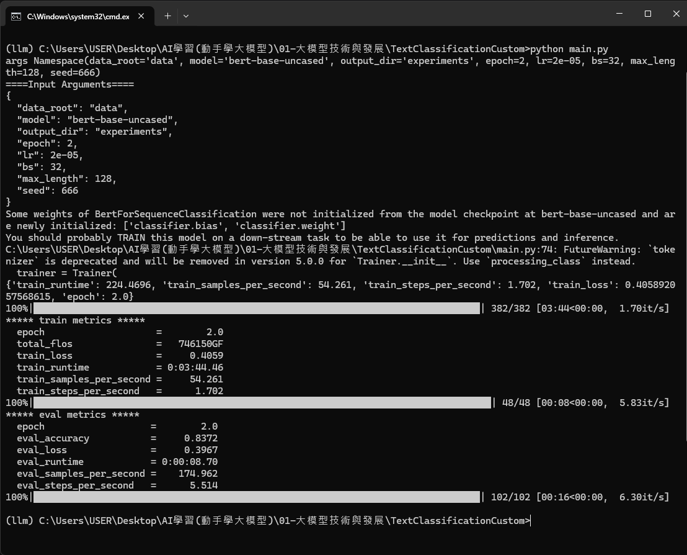

# 大模型技術與發展-操作
> 日期 : 2026/3/16
> 來源 : https://github.com/Lordog/dive-into-llms/blob/main/documents/chapter1/README.md


## 1.2 安裝環境：以文本分類（e.g., 虛假新聞檢測）為例

### 0) 安裝 Miniconda
1. 前往官方下載頁面：[Miniconda下載](https://docs.conda.io/en/latest/miniconda.html)
2. 選擇對應 Windows 版本下載並執行安裝程式。
3. 安裝過程建議勾選「Add Miniconda to my PATH」選項，這樣安裝完直接在 PowerShell/cmd/Terminal 都能用 conda 指令。
4. 安裝完成後，重新開啟終端機，輸入 `conda --version` 應能正常顯示版本。


### 1) 用 Conda 建立與啟動環境
> 💡 建議用「Anaconda Prompt」執行 conda 指令，避免 PowerShell/cmd 路徑或初始化問題，能確保 conda activate llm 正常運作。
> ⚠️ 若首次使用 conda，需先同意官方套件源服務條款，否則無法建立新環境。請先執行：
> ```bash
> conda tos accept --override-channels --channel https://repo.anaconda.com/pkgs/main
> conda tos accept --override-channels --channel https://repo.anaconda.com/pkgs/r
> conda tos accept --override-channels --channel https://repo.anaconda.com/pkgs/msys2
> ```
> 執行完畢後再進行下方環境建立。

```bash
conda create -n llm python=3.9 -y
conda activate llm
```

> ❗️如果建立環境時遇到奇怪的 UnicodeDecodeError 或安裝過程直接失敗，可以到「設定 → 時間與語言 → 語言與地區 → Windows 顯示語言」下方，開啟「Beta: 使用 Unicode UTF-8 提供全球語言支援」選項，再打開anaconda prompt試一次，也許能解決問題。

### 2) 安裝 Transformers
```bash
pip install transformers
```

### 3) 下載案例檔案
方式 A（建議）：直接 clone 整個 transformers repo
```bash
git clone https://github.com/huggingface/transformers.git
cd transformers/examples/pytorch/text-classification
```

方式 B：只下載 `requirements.txt` 與 `run_classification.py`

### 4) 安裝案例依賴
> 💡 請先用 cd 指令切換到 requirements.txt 檔案所在的資料夾，再執行下方安裝指令，否則會找不到檔案。
先編輯 `requirements.txt`，移除或註解 `torch` 相關套件，再安裝：
```bash
pip install -r requirements.txt
```

### 5) 安裝 PyTorch
若你要使用 GPU，建議使用 conda 安裝：
```bash
conda install pytorch
```

若只需要 CPU，則可維持 pip 安裝版本。


## 資料準備
以 Kaggle 虛假推文資料集為例：
- https://www.kaggle.com/c/nlp-getting-started/data

建議流程：
1. 下載 `train.csv`、`test.csv`。
2. 放到你執行 `run_classification.py` 的資料目錄（例如 `data/`）。
3. 依 README 參數設定 `--train_file`、`--validation_file` 或相關欄位參數。


## 操作提醒
- 每次執行 Python / pip / 訓練指令前，先確認已啟動環境：`conda activate llm`。
- 可用以下指令確認目前 Python 路徑是否在 `llm` 環境：
```bash
where python
python -V
```




## 訓練結果解讀（對照截圖）

若終端機看到以下重點：
- train_runtime: 224.4696
- train_loss: 0.4059
- eval_accuracy: 0.8372
- eval_loss: 0.3967
- epoch: 2.0

可這樣理解：

1. 訓練是否成功
- 進度條顯示 382/382，且最後有 train metrics，代表 2 個 epoch 已完整跑完。
- train_runtime 約 224 秒（3 分 44 秒），表示整體流程正常完成。

2. 訓練指標意義
- train_loss=0.4059：訓練損失，通常越低越好。
- train_steps_per_second=1.702：每秒約 1.7 個訓練 step，可用來比較不同參數下的速度。

3. 驗證指標意義
- eval_accuracy=0.8372：驗證集正確率約 83.72%，代表模型已有不錯效果。
- eval_loss=0.3967：驗證損失與 train_loss 接近，暫時看不出明顯過擬合。

4. 這次結果可如何判斷
- 訓練流程成功
- 模型已達可用基準
- 後續可透過調整 epoch、learning rate、batch size、max_length 進一步優化

> 小提醒：第一次看到「Some weights ... were not initialized」通常是正常的，因為分類頭（classifier）會在下游任務重新初始化並透過訓練學習。


## 範例訓練指令（適合 8GB 顯存，PowerShell 版）

請先進入 data 目錄：
```powershell
cd 01-大模型技術與發展/TextClassificationCustom/data
```

執行訓練（建議用 PowerShell 反引號 ` 換行）：
```powershell
python run_classification.py `
    --model_name_or_path bert-base-uncased `
    --train_file train.csv `
    --validation_file val.csv `
    --test_file test.csv `
    --shuffle_train_dataset `
    --metric_name accuracy `
    --text_column_name "text" `
    --text_column_delimiter "`n" `
    --label_column_name "target" `
    --do_train `
    --do_eval `
    --do_predict `
    --max_seq_length 128 `
    --per_device_train_batch_size 8 `
    --learning_rate 2e-5 `
    --num_train_epochs 1 `
    --output_dir experiments/
```

> 若用 cmd 或 .bat，請將所有參數寫成一行。


