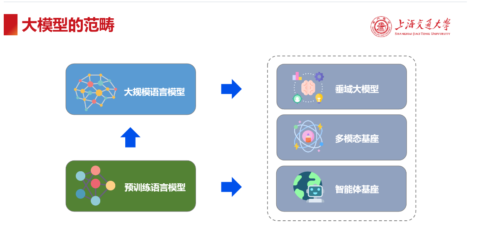

# 大模型技術與發展
> 日期 : 2026/3/16
> 來源 : https://github.com/Lordog/dive-into-llms/blob/main/documents/chapter1/dive-into-llm.pdf
> 《动手学大模型》系列编程实践教程，由上海交通大学《自然语言处理前沿技术》（NIS8021）、《人工智能安全技术》课程（NIS3353）讲义拓展而来（教师：张倬胜），旨在提供大模型相关的入门编程参考。本教程属公益性质、完全免费。通过简单实践，帮助同学们快速入门大模型，更好地开展课程设计或学术研究。

## 大綱
1. [大模型概述](#1-大模型概述)
2. [預訓練模型](#2-預訓練語言模型)
3. [大規模模型](#3-大規模模型)
4. [概念延伸](#4-概念延伸)

## 1. 大模型概述

---

### 人工智慧的發展

懶人包： 當前 AI 核心在於利用「海量無標註數據」進行「自監督預訓練」，通過自然語言交互完成多種任務，具備多場景、多用途、跨學科的任務處理能力，使模型從專用轉向通用（大模型時代）。

---

### 大模型的範疇

## 2. 預訓練語言模型

---

### 主要類型
> 代表 : ELMo、BERT、GPT-1/2

- 大規模數據上自監督預訓練，經微調後適配各類任務。
- 主要用於語言解析和理解任務。

| 架構類型 | 核心代表 | 適合任務 | 你需要學到什麼程度？ |
|-------|-------|-------|----------------|
| Encoder-only | BERT | 分類、標註、情緒分析 | 了解概念，現在多被 LLM 取代。 |
| Decoder-only | "GPT, Llama" | 所有生成式、對話、推理、Agent | 你的主攻方向，必學！ |
| Encoder-Decoder | "T5, BART" | 翻譯、精確摘要、文本重寫 | 知道它是處理 Seq2Seq 的專門架構即可。 |

---

### 模型架構

- RNN (LSTM)
  - 捕捉詞間的依賴關係。但因為梯度計算問題， RNN 常常難以訓練。
  - 計算速度很慢，學習長依賴的能力也有限。

- Transformer (Attention is all you need)
  - 完全摒棄 RNN 循環機制，採用自注意力機制進行全局處理。
  - 三個權重矩陣(Query、Key、Value)捕捉上下文依賴關係。
  - 多層網絡: 每層由多頭注意力機制和前饋網路構成。
  - 添加了位置編碼(Positional Encoding)

## 3. 大規模模型

> 後續移至來源進行查看。

---

### 關鍵技術

- 經典的三個主要構建階段: 預訓練、指令微調、對齊

#### 關鍵技術1 : 預訓練

#### 關鍵技術2 : 指令微調

- 透過高品質指令數據(告訴模型執行甚麼任務)對模型進行微調
  - 幫助模型理解任務特徵，大幅提升在各個任務上的性能表現
  - 改善提示學習的穩定性，讓模型輸出文本更為可控
- 以"自然語言推理"為例，構造指令微調訓練數據

- **指令微調方式**
  - **借助現有的數據集**: 通過人為添加指定當前任務類型的提示作為輸入的前綴(指令)，在多類型數據集上進行微調
  - **基於人類演示的有監督微調**: 基於人類根據提示(指令)撰寫的高品質回答，模型據此來進行有監督微調

- 數據構造要點
  - 任務數量
  - 任務多樣性
  

   
#### 關鍵技術3 : 對齊

- 與人類偏好、價值觀、意圖、安全等方面的"對齊"
  - 定義: 引導人工智慧系統的行為，使其符合設計者的利益與預期目標

- 原則: 有用、誠實、無害
- 核心技術: 主要透過 **RLHF (Reinforcement Learning from Human Feedback)** 與 **DPO (Direct Preference Optimization)** 等方法實現。
- 技術要點:

> 後續移至來源進行查看。

---

### 大規模語言模型的擴展定律(Scaling Law)
- 模型性能與模型大小、數據規模和算力三者之間的關係
  - 隨著模型參數規模和預訓練數據規模的不斷增加，模型能力與任務效果將會隨之改善。 

---

### 大規模語言模型的湧現能力(Emergent Abilities)

- 語言模型參數達到一定規模時，某些能力表現(語言推理)會突然大幅提升
- 在小模型中未觀察到但在大模型中體現出來的能力

---

### 大規模語言模型的幻覺(Hallucination)
- 定義: 模型生成的文本不遵循原文(Faithfulness)或不符合事實(Factualness)
- 能力優勢: 大規模創造性和發散能力的體現
- 潛在影響: 影響規模可信度，容易被攻擊、被濫用(如惡意內容生成和散播謠言)

---

---

### 部署大模型

- 大模型類型:
  - 大語言模型
  - 多模態模型

- 部署方式:
  - API調用
  - 本地部署

#### 本地部署

## 4. 概念延伸

### 大模型概念延伸

### 垂域大模型
- 基本範式: 在通用大模型基礎上進行領域訓練增強，專業性強、落地速度快、成本效益高、合規性好
- 訓練方式: 領域數據訓練(繼續預訓練、微調、提示)、檢索增強等
- 常見領域: 教育、醫療、法律、金融等

### 多模態大模型
> 後續移至來源進行查看。

### 大規模智慧體
- 基於大模型構建，能夠動態指導其自身流程和工具使用，並根據實時反饋調整自己的操作的系統

